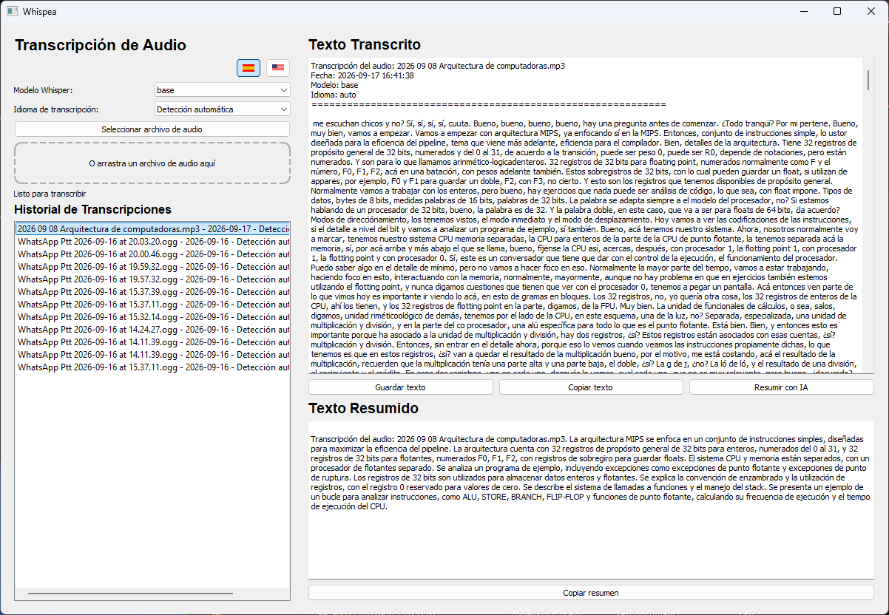

# Whispea

¿Cansado de recibir audios en clase y no poder escucharlos? ¿De tener grabaciones de clases de 2 horas y querer saber si es la clase que necesitás ver ahora? ¿Siempre renegando porque las alternativas web no permiten cosas largas o te piden pagar?

Yo también. Por eso armé **Whispea**: una herramienta de escritorio que transcribe y resume audio de manera **100% local**, corriendo modelos en tu propia máquina — sin subir nada a ningún server, sin APIs pagas, sin límites de duración.



## Características

- **Transcripción local con faster-whisper** — arrastrá o seleccioná un audio y obtené el texto
- **BatchedInferencePipeline** — transcripción ~2x más rápida en CPU con `batch_size=8`
- **Resumen con IA local con Ollama** — un clic y un modelo local ([Ollama](https://ollama.com)) te resume la transcripción en un párrafo
- **Historial** — cada transcripción y su resumen quedan guardados y se pueden recargar con un clic
- **Multiidioma** — interfaz en español e inglés (selector con banderas), transcripción en 30 idiomas
- **Preferencias persistentes** — modelo Whisper, idioma de transcripción e idioma de UI se guardan en `prefs.json`
- **Drag & drop** — arrastrá el archivo a la ventana y listo
- **Sin límites de duración** — tu máquina, tus reglas: audios de 2 horas incluidos

## Requisitos

- Python 3.10+
- [FFmpeg](https://ffmpeg.org) en el PATH (opcional: faster-whisper decodifica mp3, ogg, flac, m4a y otros formatos nativamente con PyAV, pero FFmpeg sigue siendo útil para otros archivos de audio)
- [Ollama](https://ollama.com) instalado + un modelo para los resúmenes (ver Instalación)

## Instalación

```bash
git clone https://github.com/TU-USUARIO/whispea.git
cd whispea

# Crear y activar venv
python -m venv venv
.\venv\Scripts\Activate.ps1    # Windows PowerShell
# source venv/bin/activate     # Linux/Mac

# Dependencias
pip install -r requirements.txt

# Modelo para los resúmenes (~2GB)
ollama pull qwen2.5:3b
```

### Preferencias

Copiá el ejemplo de preferencias y ajustalo a tu gusto:

```bash
cp prefs.example.json prefs.json
```

`prefs.json` guarda:
- `model_size`: `tiny` | `base` | `small` | `medium` | `large` (default: `large`)
- `transcription_language`: código de idioma o `auto`
- `ui_language`: `es` | `en`

El archivo está en `.gitignore` para que sea local por usuario.

## Uso

```bash
python main.py
```

1. Seleccioná o arrastrá un archivo de audio (mp3, wav, ogg, flac, m4a, wma, aac, opus)
2. Esperá a que termine la transcripción
3. Clic en **"Resumir con IA"** para generar el resumen
4. **"Copiar resumen"** / **"Copiar texto"** / **"Guardar texto"** para lo que necesites

## Cómo funciona

- **Transcripción**: [faster-whisper](https://github.com/faster-whisper/faster-whisper) corre 100% local en CPU usando PyAV para decodificar el audio directamente (mp3, ogg, flac, m4a, wma, aac, opus) sin necesidad de convertir a WAV antes
- **Resumen**: la app le pega a un server local de [Ollama](https://ollama.com) (`http://localhost:11434`) con el modelo configurado — el texto nunca sale de tu máquina
- **Historial**: todo queda en `history/`

## Estructura del proyecto

- `main.py` → ventana principal (`AudioTranscriberApp`) y punto de entrada
- `config.py` → configuración, preferencias (`prefs.json`) e internacionalización (`TRANSLATIONS`, `WHISPER_LANGUAGES`)
- `core.py` → hilos de trabajo (`TranscriptionThread`, `SummaryThread`, `ModelPreloadThread`)

## Configuración

### Preferencias persistentes

Las preferencias de usuario se guardan en `prefs.json`:
- `model_size` → modelo Whisper a usar
- `transcription_language` → idioma de transcripción o `auto`
- `ui_language` → idioma de la interfaz `es`/`en`

Ejemplo: `prefs.example.json`

### Variables en `config.py`

| Constante | Default | Qué hace |
|---|---|---|
| `OLLAMA_MODEL` | `"qwen2.5:3b"` | El modelo de Ollama que resume (cambialo por `qwen2.5:7b` si querés más calidad) |
| `PROMPT_TEMPLATE` | `"Resumí el siguiente texto..."` | El prompt que se le envía al modelo |
| `MAX_SUMMARY_INPUT_CHARS` | `25000` | Límite de caracteres que se envían al modelo |

## Notas

- El modelo elegido (`qwen2.5:3b`, ~2GB) corre rápido en CPU (~15-25 tok/s en un Ryzen 7) y es de lo mejor en español para resúmenes
- Si Ollama no está corriendo, la app te avisa con un mensaje claro (no crashea)
- Probado en Windows 11; debería funcionar en Linux/Mac ajustando la activación del venv
